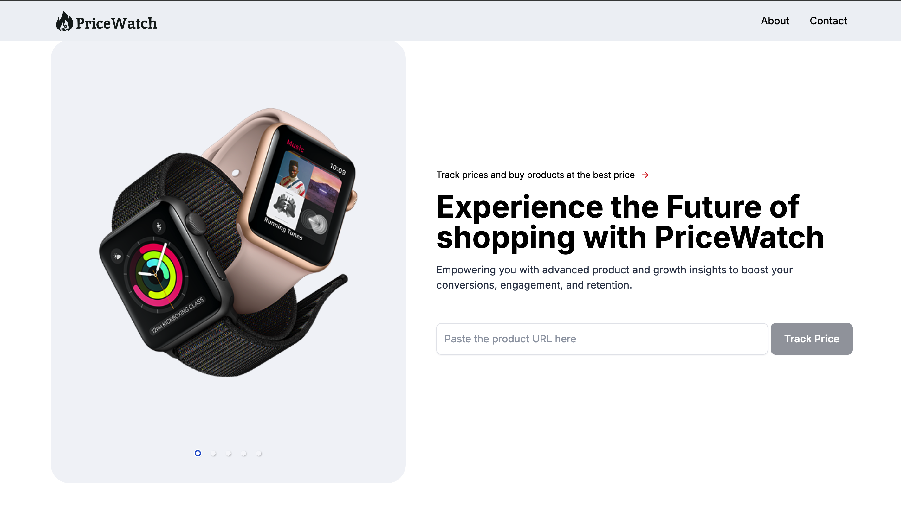
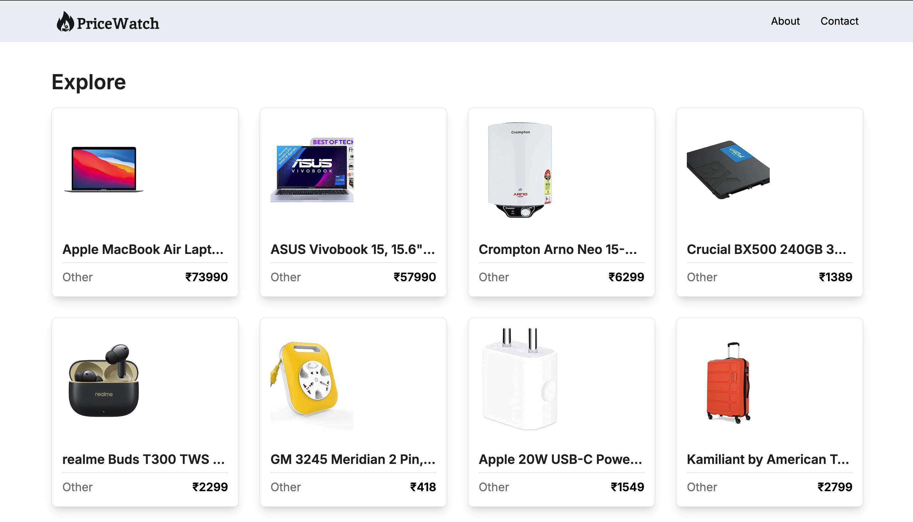
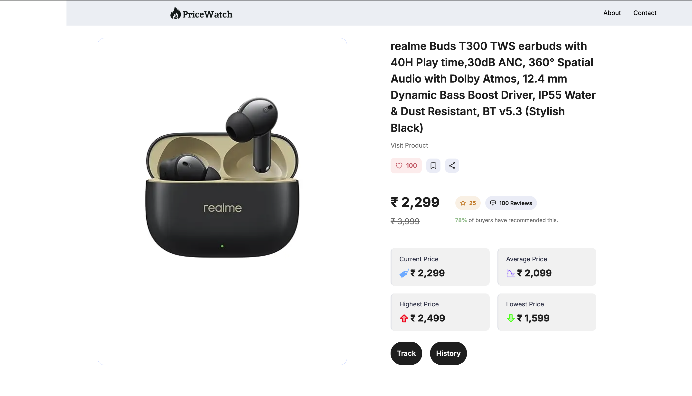
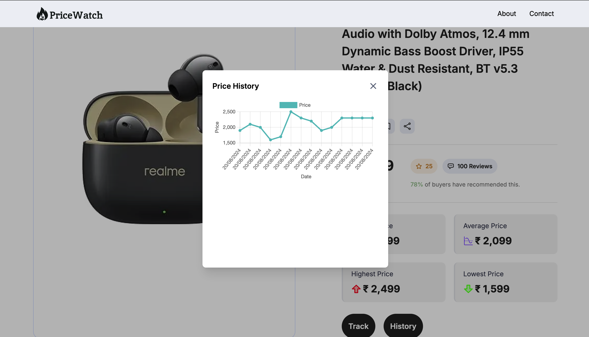
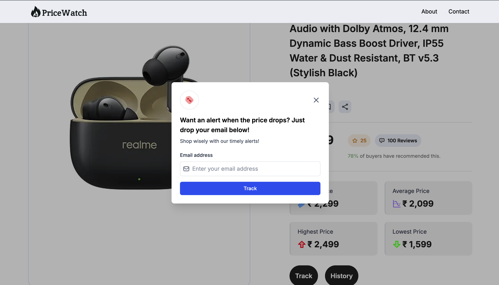
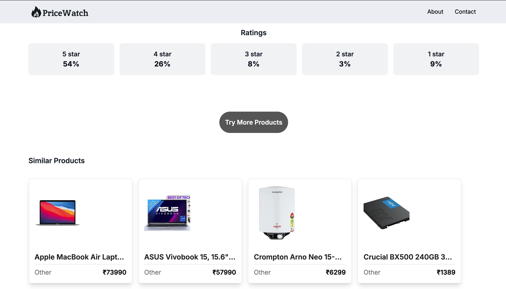

## Overview

Pricewatch is a web application built with Next.js that helps users track product prices and receive notifications for price drops or restocks. It offers a user-friendly interface for monitoring product price history and managing alerts.

## Features

* Real-time price tracking for products
* Price drop notifications
* Restock alerts
* Intuitive user interface

## Technologies Used

* **Frontend:** Next.js, Tailwind CSS
* **Backend:** Next.js, Mongoose (for MongoDB)
* **Data Scraping:** Custom scraper (lib/scraper.js)
* **Notifications:** email notifications (lib/nodemailer/)
* **ScrapingService:** BrightData
* **CronJobService:** cron-job.org

## Project Structure
```
├── app
│   ├── api(for cron job)
│   ├── globals.css
│   ├── page.tsx
│   ├── favicon.ico
│   ├── layout.tsx
│   └── products(page.tsx)
├── components
│   ├── HeroCarousel.tsx
│   ├── PriceInfoCard.tsx
│   ├── chartModal.tsx
│   ├── Modal.tsx
│   ├── ProductCard.tsx
│   ├── Navbar.tsx
│   └── Searchbar.tsx
├── lib
│   ├── actions(server index.ts)
│   ├── mongoose.ts
│   ├── scraper(index.js)
│   ├── models(product.model.ts)
│   ├── nodemailer(index.ts)
│   └── utils.ts
├── node_modules
│   └── many files
├── public
│   ├── assets(icons)
│   ├── next.svg
│   └── vercel.svg
├── types
│   └── index.ts
├── package-lock.json
├── package.json
├── tailwind.config.ts
├── next-env.d.ts
├── tsconfig.json
├── next.config.js
└── postcss.config.mjs


```

## Installation

**Prerequisites:** Next.js, npm

1. Clone the repository: `git clone https://github.com/ronaksharma77/pricewatch.git`
2. Navigate to the project directory: `cd pricewatch`
3. Install dependencies: `npm install`

## Usage

1. Start development server: `npm run dev` or `yarn dev`
2. Create an account (if applicable)
3. Track products using the search bar or browsing features

## Page pictures


*Home Page*


*Explore Page*


*Product Page*


*Price Graph Page*


*Mail Page*


*Rating Page*

## Contact

- **GitHub:** [ronaksharma77](https://github.com/ronaksharma77)
- **Email:** ronaksharma.rk77@gmail.com


